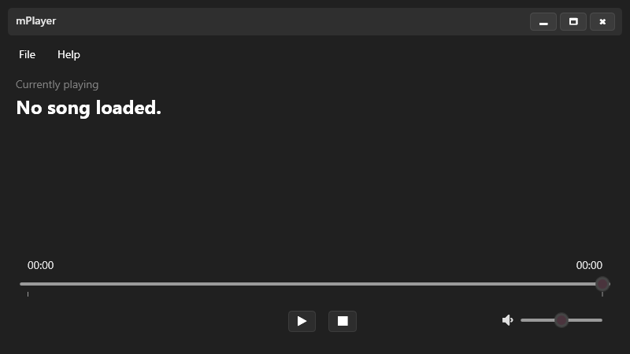
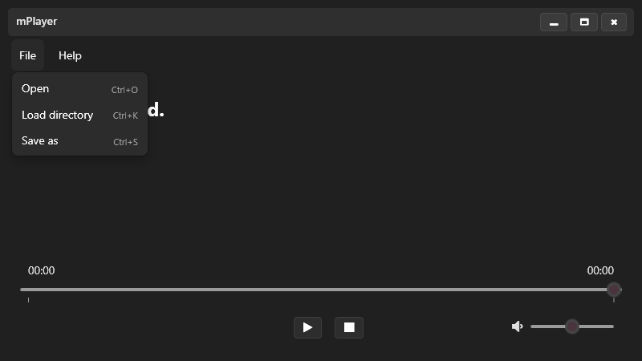
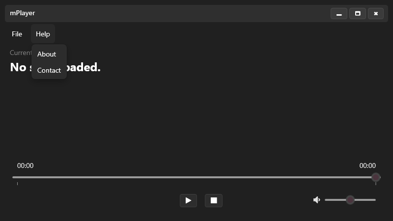

# mPlayer

A simple music player application built with WPF, using third-party packages such as [WPF-UI]() (*for stylization*) and [NAudio]() (*for audio manipulation*). Implements features such as audio playback (`.mp3, .wav` formats), playback cancellation, volume slider, queuing all songs in a directory (basically playlists) and playlist serialization/deserialization. 

### Visual examples

### TODO
[o] Visualization (waveforms or cover art based on the track title)  
[o] Recent playlists quick access